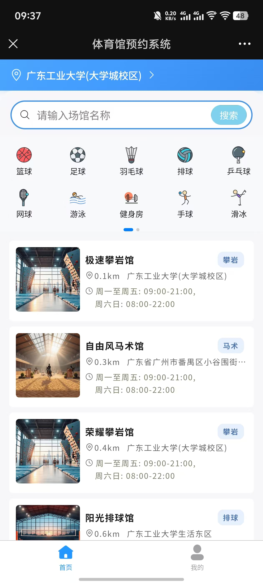
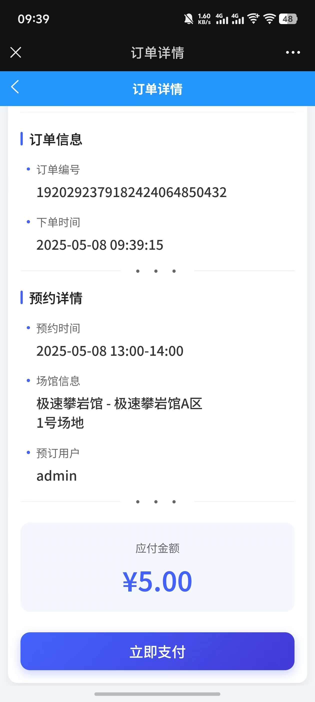

# 🏟️ 场馆预定平台

## 📖 项目背景

随着人们生活水平的提高和对健康、娱乐需求的增长，各类体育运动、文化活动等越来越受到大众的喜爱。然而，在组织这些活动时，找到合适的场地往往成为了一个难题。尤其是在城市中，公共资源有限，而需求量大，这导致了场地资源的紧张。此外，传统的场地预定方式效率低下，通常需要通过电话或者亲自前往场地进行咨询和预订，这种方式不仅耗时费力，而且信息更新不及时，容易造成资源浪费。因此开发一个高效、便捷的场馆在线预订平台至关重要，该平台可以帮助提高场馆使用率，降低预约冲突，优化广大用户的预订体验。

在学校中，羽毛球、篮球、乒乓球等运动深受学生喜爱，但面对学生数量多而场馆资源有限的情况，为了公平使用这些资源，学校会在特定时间开启场馆的在线预订。此时，大量学生同时尝试预订，导致系统需处理极高的并发请求。这就要求预订平台接口具备高吞吐量和稳定性，确保能快速准确地处理众多学生的预订需求，避免超订或预订失败，保证每位学生都有公平的机会享受到运动设施。高效的预订系统对于满足学生运动需求和提升场馆利用率至关重要。

## 🚀 在线体验

​**传送门**​：[https://hellodam.website/](https://hellodam.website/) （建议使用手机访问）

    
    
    
    
    
    
    
        
    
    
    
    

## 🛠️ 技术架构

服务端采用 JDK17 + SpringBoot3 + SpringCloud 微服务架构，旨在构建高并发、大数据量下仍然能提供高效可靠的场馆预定服务，项目中包含了缓存、消息队列、分库分表、设计模式等代码实现。

    

## 🎯 项目核心技术学习要点总结

### 🔐 **分布式认证与权限控制**  

**ThreadLocal + JWT + Gateway**  
- **使用 JWT 无状态特性存储登录态**  
- **网关层统一鉴权过滤**   

### ⚡ **性能优化方案**  

**缓存穿透/击穿解决方案**  
- **布隆过滤器**解决用户名查重穿透  
- **互斥锁**解决场馆查询击穿  

**预定接口性能优化**  
- **Lua脚本+Redis BitMap**实现场地存储和分配  
- **库存限流 + 异步处理**提高响应速度  
- **Jmeter动态参数压测**（仿多个不同用户同时预定）  
- **延时消息**实现未支付订单自动关闭  

**时间段生成优化**  
- **MySQL流式查询 + Redis管道加速**  

**数据库效率优化**  
- **ShardingSphere分库分表**降低单表数据量  
- **数据表索引优化**  

### 🆔 **分布式问题**  
- **雪花算法**生成唯一ID  
- **分布式场景任务调度**避免重复执行  
- **分布式环境下的WebSocket Session处理**  

### 🔄 **数据一致性方案**  
- **先数据库再删缓存**处理访问不频繁的数据  
- **Canal监听Binlog**异步刷新访问频率高缓存  
- **本地消息表 + 定时任务**处理订单生成、库存扣减的分布式事务问题  

### 🎨 **设计模式应用**  
- **责任链模式**封装不同缓存处理器  
- **单例模式**封装Lua脚本对象  
- **策略模式**根据不同本地消息获取不同的MQ生产者  

### 🌐 **其他**  
- **支付宝沙箱支付**整合（发起支付、异步回调、退款）  
- **FastExcel**解析Excel文件  
- **SSL证书**申请（HTTP升级HTTPS）  
- **完整前后端部署方案**（含域名购买、解析）  

## 🌟 项目介绍

本项目采用 SaaS 方式开发。"SaaS"即"软件即服务"，SaaS 方式不需要用户在手机或者电脑中安装软件，直接通过互联网访问在线程序即可接入使用。开发 SaaS 项目需要考虑应对如下重要问题：

- 🚀 ​**高并发**​：在高峰期需要面对大量用户同时访问，对系统性能和响应速度要求较高。
- 💾 ​**数据量大**​：数据库、缓存中需要存储大量的用户数据，需要考虑分库分表、集群。
- 🏢 ​**多租户**​：因为支持多个租户同时使用，需要不同租户间的数据隔离、安全，避免数据泄露。
- ⚡ ​**高可用、高拓展**​：需要具备良好的扩展性，以应对用户数量和业务规模的增长。

​**启动方式**​：

为了方便大家使用，项目提供了两种启动部署方式：

1. ​**SpringBoot 聚合服务版本**​：适合测试和部署，直接启动聚合服务`vrs-aggregation`和网关服务`vrs-gateway`即可。
2. ​**SpringCloud 微服务版本**​：需要启动用户、场馆、支付、订单和网关服务。

## ✨ 功能说明

下图为功能规划，部分功能仍在开发当中

    

## 📚 实现文档

为了方便大家对项目进行理解学习，部分重要功能实现提供了详细文档：

- 📝 [面向微服务的Spring Cloud Gateway的集成解决方案：用户登录认证与访问控制](https://hellodam.blog.csdn.net/article/details/144646668)
- 🖼️ [基于 Spring Boot 实现图片的服务器本地存储及前端回显](https://hellodam.blog.csdn.net/article/details/144057650)
- 🔍 [整合 Knife4j 于 Spring Cloud 网关：实现跨服务的 API 文档统一展示](https://hellodam.blog.csdn.net/article/details/144621332)
- 📊 [基于 mzt-biz-log 实现接口调用日志记录](https://hellodam.blog.csdn.net/article/details/144501418)
- 🌐 [腾讯云域名购买、备案、解析：一步到位的实操手册](https://hellodam.blog.csdn.net/article/details/144917596)
- ⏱️ [分布式环境下定时任务扫描时间段模板创建可预订时间段](https://hellodam.blog.csdn.net/article/details/144966324)
- ⚡ [场馆预定平台高并发时间段预定实现V1](https://hellodam.blog.csdn.net/article/details/144950335)
- 🔄 [使用 Canal 监听 MySQL Binlog 日志实现最终一致性](https://hellodam.blog.csdn.net/article/details/144483823)
- 📈 [Jmeter 动态参数压力测试时间段预定接口](https://hellodam.blog.csdn.net/article/details/145247471)
- 🚀 [场馆预定平台高并发时间段预定实现V2](https://hellodam.blog.csdn.net/article/details/145281039)
- ⛓️ [接口 V2 完善：基于责任链模式、Canal 监听 Binlog 实现数据库、缓存的库存最终一致性](https://hellodam.blog.csdn.net/article/details/145308548)
- 💬 [接口 V2 完善：分布式环境下的 WebSocket 实现与 Token 校验](https://hellodam.blog.csdn.net/article/details/145345779)
- 💰 [支付宝沙箱指南：如何实现手机网站支付](https://hellodam.blog.csdn.net/article/details/144942881)（为啥不整合微信支付，因为微信支付需要申请商户号，需要营业执照那些。支付宝则提供了沙箱支付，方便开发者开发、测试使用）
- 📊 [基于 FastExcel 与消息队列高效生成及导入机构用户数据](https://hellodam.blog.csdn.net/article/details/145124318)
- 🗺️ [基于 Redis GEO 实现条件分页查询用户附近的场馆列表](https://hellodam.blog.csdn.net/article/details/145399470)
- 🔄 [预订接口 V2 优化：使用本地消息表保证订单生成、库存扣减的一致性](https://hellodam.blog.csdn.net/article/details/147672978)

    

## 👨‍💻 贡献者

- ​**后端**​ [HelloDam 博客主页](https://hellodam.blog.csdn.net/)
- ​**前端**​ [yan-li-ruitong 博客主页](https://blog.csdn.net/loverdany)

## 🔗 相关仓库

- [场快订前端代码仓库](https://gitee.com/HelloDam/venue-reservation-front)